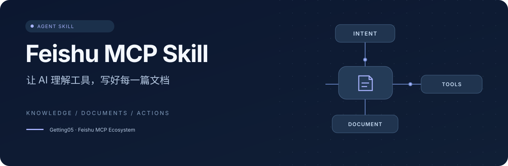

<p align="center">
  
</p>

<p align="center">
  
  
  
  
</p>

<h3 align="center">从一句需求，到结构清晰的飞书文档</h3>
<p align="center">工具选型 · 知识库工作流 · 原生内容结构 · 写后核对</p>
<p align="center">
  <a href="#quick-start">开始使用</a> ·
  <a href="#scenarios">使用场景</a> ·
  <a href="SKILL.md">Skill 入口</a> ·
  <a href="references/tools.md">工具示例</a> ·
  <a href="https://github.com/Getting05/FeishuMCP">MCP 服务 ↗</a>
</p>

---

**Feishu MCP Skill** 是 [Getting05/FeishuMCP](https://github.com/Getting05/FeishuMCP) 的配套 Skill。它指导 AI 根据任务选择工具、准确定位知识库与文档、保留标题和公式等原生结构，并在写入后核对结果。

<table>
<tr>
<td width="50%"><strong>🧭 选对工具</strong><br />根据目标资源与当前工具 schema 选调用路径，不混用其他 MCP 的参数。</td>
<td width="50%"><strong>📚 用好知识库</strong><br />从父页面链接创建文档，读取和定位块，再追加、重命名或管理页面。</td>
</tr>
<tr>
<td><strong>✍️ 保留原生结构</strong><br />标题、表格、公式、代码与图片分别使用适合的表示方式。</td>
<td><strong>🔍 核对写入结果</strong><br />读回内容与块结构，处理权限错误和不确定响应，避免重复创建。</td>
</tr>
</table>

<a id="quick-start"></a>
## 开始使用

### 1. 连接 MCP 服务

在支持 Streamable HTTP MCP 的客户端中添加：

```text
https://feishumcp.chengetting.workers.dev/mcp
```

确认客户端可取得服务工具列表。服务使用应用身份，目标资源必须向应用开放访问权限；配置与部署见 [FeishuMCP](https://github.com/Getting05/FeishuMCP)。

### 2. 加载整个 Skill 文件夹

```bash
git clone https://github.com/Getting05/Feishu-MCP-Skill.git feishu-mcp
```

把 `feishu-mcp` 文件夹放到客户端识别的 Skill 目录，或按该客户端的方式导入。请保留 `SKILL.md` 和 `references/`，不要只复制入口文件；客户端会按任务读取参考页。

Skill 名称为 **`feishu-mcp`**。如果使用旧版 `feishu-document-authoring`，更新后重新加载；支持显式调用的客户端可使用 `$feishu-mcp`。

### 3. 给出目标与需求

> 使用 feishu-mcp，在这个 Wiki 页面下新建“项目周报”，保留标题层级，加入进展列表与状态表，完成后读回核对。

提供准确的父页面或目标文档链接，AI 就可以按 Skill 选择流程。无需把飞书 App Secret 写进 Skill；应用凭据由 MCP 部署方配置。

<a id="scenarios"></a>
## 适合哪些任务

| 你想做的事 | Skill 的工作方式 |
| --- | --- |
| 在 Wiki 下新建周报 | 解析父页面 → 创建 Docx → 写入 Markdown → 读回 |
| 修改文档的一段结论 | 读取 → 查找 block_id → 定点更新 → 核对 |
| 整理知识库页面 | 列子页面，按明确目标重命名、复制或移动 |
| 写技术报告或论文翻译 | 保留标题、公式、表格、图注、代码和来源信息 |
| 操作多维表格或云空间资源 | 查当前 API 目录及官方参数，再选择领域工具 |
| 处理调用失败 | 区分应用 scope、资源权限、身份限制和不确定响应 |

## 文档导航

| 文件 | 何时阅读 |
| --- | --- |
| [SKILL.md](SKILL.md) | 通用规则、工具选型与日常流程 |
| [工具与示例](references/tools.md) | 26 个工具分组、实际参数与 JSON 调用 |
| [原生文档写作](references/rich-documents.md) | 论文、公式、表格、图示与复杂富文本 |
| [权限与排错](references/access-and-errors.md) | 应用授权、资源权限、错误码与恢复 |

<details>
<summary><strong>查看 Skill 结构</strong></summary>

```text
feishu-mcp/
├── SKILL.md
└── references/
    ├── tools.md
    ├── rich-documents.md
    └── access-and-errors.md
```

仓库的 `assets/` 用于 README 和 GitHub 分享封面，不影响 Skill 调用。

</details>

## 能力与权限边界

此 Skill 对齐 FeishuMCP **1.1.0 的 26 个工具**（2026-09-30 快照）。实际工具名和参数以连接服务返回的 schema 为准。

> [!IMPORTANT]
> 服务统一使用 `tenant_access_token`。用户在网页里能访问某文档，不保证应用能读写；用户身份的 scope 也不能直接用于应用请求。Wiki 父节点创建权限不足时，会返回 `131006`。

Markdown 可以写入标题、列表、表格和代码，单次最多 1000 个转换后的块；图片需要单独上传并绑定。纯文本块替换可能丢失内联样式，复杂内容按原生 Docx 接口处理。

消息、任务、通讯录与用户专属 OAuth 操作不在此服务的工具范围内。Skill 本身不提供额外权限或另一套 CLI。MCP 服务当前的客户端访问限制见 [服务访问说明](https://github.com/Getting05/FeishuMCP/blob/main/docs/ACCESS.md)。

## Server 与 Skill

| 仓库 | 责任 |
| --- | --- |
| [FeishuMCP](https://github.com/Getting05/FeishuMCP) | 连接飞书 API、管理应用令牌、执行工具与事件接收 |
| **Feishu-MCP-Skill** | 指导 AI 选工具、保留内容结构、核对结果及排查问题 |

## 参考与反馈

参考 [cso1z/Feishu-Skill](https://github.com/cso1z/Feishu-Skill) 与 [whatevertogo/FeiShuSkill](https://github.com/whatevertogo/FeiShuSkill) 的模块化参考页与示例组织方式。本 Skill 的工具名和调用参数以 Getting05 的 MCP 为准。

反馈时请附上使用场景、脱敏后的工具调用与预期结果。已有 MCP API 错误请同时提供飞书错误码；Skill 的选择或文档结构问题在本仓库反馈。

<p align="center"><sub>Feishu MCP Ecosystem · <a href="https://github.com/Getting05/FeishuMCP">Server + Skill</a></sub></p>
